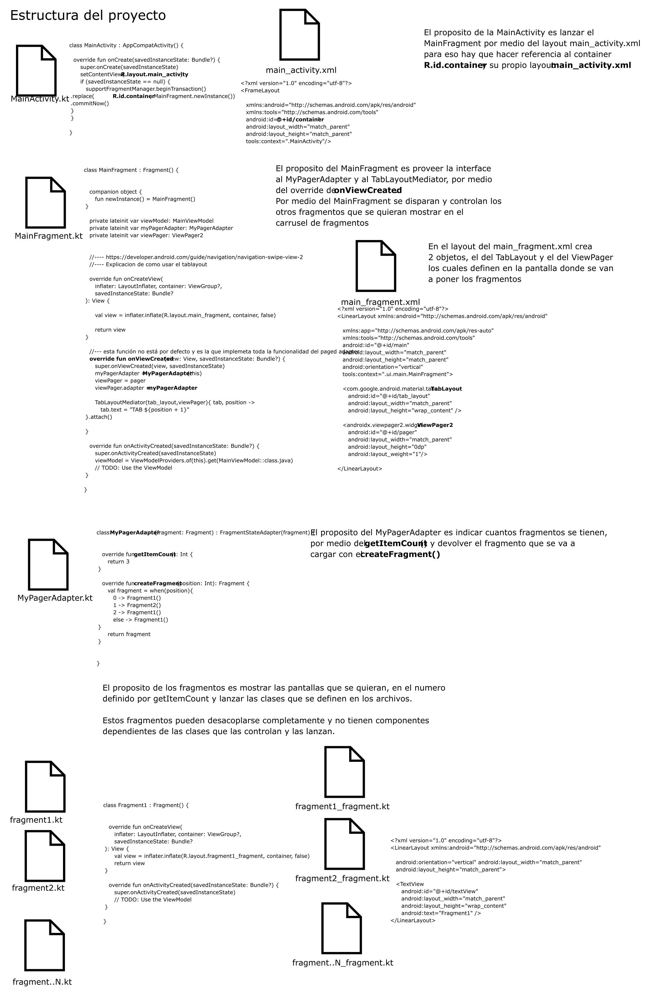

# basictablayout
Android tab layout

Este es un ejemplo de android de como usar el Viewpager2 con tabs.
Con el proposito de documentar como habilitar para un proyecto.

Ver el enlace de documentación en:  https://developer.android.com/guide/navigation/navigation-swipe-view-2

Esta es la estructura del archivo:

=======
Que hace el Viewpager2 ?

Viewpager2 permite por medio del movimiento del swipe cambiar de fragment, como cambiar de pantalla de izquierda a derecha, y con Tabs, permite identificar con un titulo el nombre del tab:

__Dependencias que hay que habilitar__
Es necesario habilitar los componentes del gradel del modulo así:

    implementation "androidx.viewpager2:viewpager2:1.0.0"  //-- todo dependencia necesaria para viewpager
    implementation 'com.google.android.material:material:1.1.0' //-- todo componentes necesarios de material
    
1 - El MainActivity.kt y su layout no tienen ningún componente raro, y su proposito es poder simplemente lanzar el fragmento principal MainFragment.kt dentro de un container.
2 - Hay que crear el Adapter, en este caso llamado MyPagerAdapter.kt el cual hace override de 2 funciones, __getitemCount()__ y __createFragment()__. 

Archivo: MyPagerAdapter.kt

    override fun createFragment(position: Int): Fragment {
        val fragment = when(position){
            0 -> Fragment1()
            1 -> Fragment2()
            2 -> Fragment1()
            else -> Fragment1()
        }
        return fragment
    }

Así mismo se deberán contar cuantos fragmentos se van a tener con el getItemCount() en el mismo archivo:

    override fun getItemCount(): Int {
        return 3
    }
    
3 - Se crean los gragmentos haciendo su Clase y su layout.

4 - El MainFragment.kt debe hacerle override a la función onViewCreated(), la cual instancia el __adapter__ y también instancia el __Tab__ y lo carga como se muestra:

    //--- esta función no está por defecto y es la que implemeta toda la funcionalidad del paged adapter
    override fun onViewCreated(view: View, savedInstanceState: Bundle?) {
        super.onViewCreated(view, savedInstanceState)
        myPagerAdapter = MyPagerAdapter(this)
        viewPager = pager
        viewPager.adapter = myPagerAdapter

        TabLayoutMediator(tab_layout,viewPager){ tab, position ->
            tab.text = "TAB ${position + 1}"
        }.attach()
    }
    
    
5 - En el layout del __main_fragment.xml__  se implementan el Tab layout y el Viewpager2 como se observa en el archivo a continuación.

            <LinearLayout xmlns:android="http://schemas.android.com/apk/res/android"
                xmlns:app="http://schemas.android.com/apk/res-auto"
                xmlns:tools="http://schemas.android.com/tools"
                android:id="@+id/main"
                android:layout_width="match_parent"
                android:layout_height="match_parent"
                android:orientation="vertical"
                tools:context=".ui.main.MainFragment">
            
                <com.google.android.material.tabs.TabLayout
                    android:id="@+id/tab_layout"
                    android:layout_width="match_parent"
                    android:layout_height="wrap_content" />
            
                <androidx.viewpager2.widget.ViewPager2
                    android:id="@+id/pager"
                    android:layout_width="match_parent"
                    android:layout_height="0dp"
                    android:layout_weight="1"/>
            
            </LinearLayout>
            

